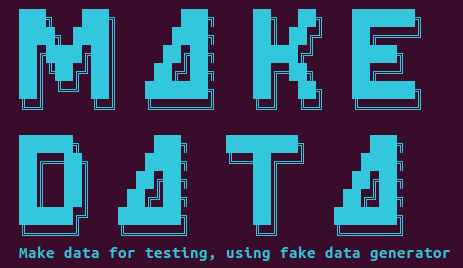

# Make_data

A Rust command-line tool to generate random (artificial) data. Data is saved as a CSV file. You can specify the number of rows, the types of columns (integer, float, word, name, phone), and the output file name. This is useful for generating mock data for testing, demos, or data science projects.



## Features

- Generate random integers, floats, words, names, and phone numbers
- Specify the number of rows and column types via command line
- Output to a CSV file with customizable filename

## Setup

1. **Install Rust** (if not already installed):

   ```sh
   curl --proto '=https' --tlsv1.2 -sSf https://sh.rustup.rs | sh
   ```

2. **Clone or download this repository** and navigate to the project directory:

   ```sh
   cd /path/to/make_data
   ```

3. **Build the project:**

   ```sh
   cargo build --release
   ```

## Usage Examples

Generate a CSV file with 100 rows, where the first column is an integer, the second is a float, the third is a random word, the fourth is a name, and the fifth is a phone number:

```sh
cargo run --release -- --rows 100 --columns int,float,word,name,phone --output mydata.csv
```

This will create `mydata.csv` in the project directory.

### All columns as random numbers

Generate a CSV file with 50 rows and 5 columns, all integers:

```sh
cargo run --release -- --rows 50 --columns int,int,int,int,int --output all_ints.csv
```

Generate a CSV file with 50 rows and 5 columns, all floats:

```sh
cargo run --release -- --rows 50 --columns float,float,float,float,float --output all_floats.csv
```

## Dependencies
- [clap](https://crates.io/crates/clap) for command-line argument parsing
- [rand](https://crates.io/crates/rand) for random number generation
- [csv](https://crates.io/crates/csv) for CSV writing
- [fake](https://crates.io/crates/fake) for generating names, phone numbers, and words

## License

This project is licensed under the MIT License. See the LICENSE file for details.

## Contributing

Contributions are welcome! If you have ideas for improvements or want to add more features, feel free to open an issue or submit a pull request.

### A Work In Progress

Check back often to see the evolution of the project! This project is a work-in-progress. Updates will come periodically.

If you would like to contribute to this project, please do! For instance, if you see some low-hanging fruit or tasks that could add value to the project, I would love to have your insight.

Otherwise, please create an issue for bugs or errors. Since I am a teaching faculty member at Allegheny College, I may not have all the time necessary to quickly fix bugs. I welcome the Open Source Community to further the development of this project. Much thanks in advance.

If you appreciate this project, please consider clicking the project's Star button. :-)
